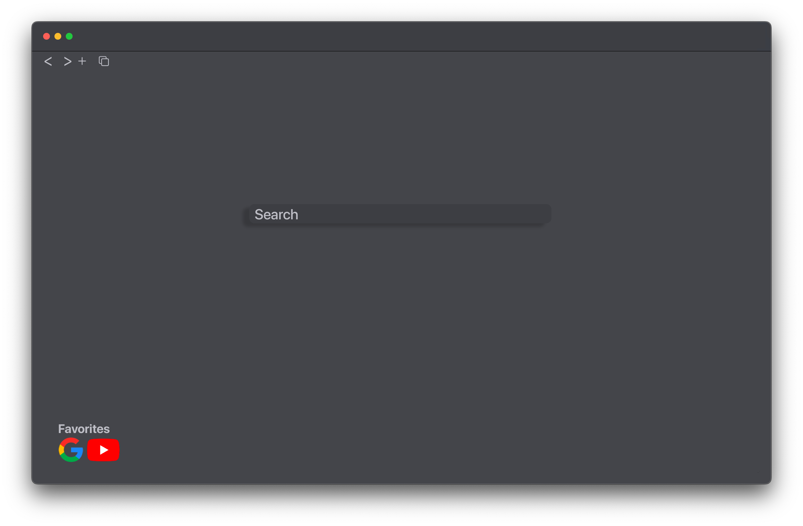

cpp_search_engine

A lightweight C++ search engine utilizing a Chromium backend for efficient web searches.

About

This project is a lightweight search engine application built in C++. It runs a Chromium instance in the background and performs web searches efficiently. After searching, it redirects the results to Google, providing faster performance and lower resource usage compared to opening a full browser. The app is simple, cross-platform, and easily shareable, making it ideal for linking or integrating into other projects.

Features

- Chromium Backend: Runs a Chromium instance in the background for web searches.
- Google Redirection: Redirects search results to Google.
- Low Resource Usage: Consumes fewer system resources than a full browser.
- Cross-Platform: Works on Windows, macOS, and Linux.
- Simple and Integrable: Can be easily integrated into other projects.

Requirements

- C++20 or newer compiler
- CMake 3.10 or newer
- Chromium or Chromium Embedded Framework (CEF)

Installation

1. Clone the project:
   git clone https://github.com/sddmr/cpp_search_engine.git
   cd cpp_search_engine

2. Install dependencies (example for Ubuntu):
   sudo apt-get install libcef-dev

3. Build the project:
   cmake .
   make

4. Run the application:
   ./search_engine

Usage

To perform a search from the terminal:
   ./search_engine "search term"

This will search for the specified term and show results on Google.

